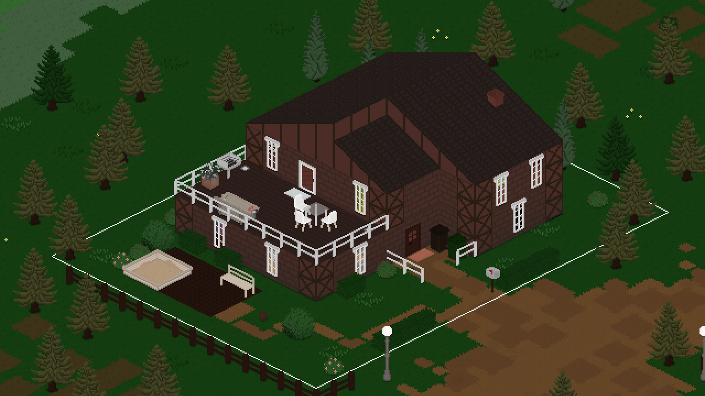
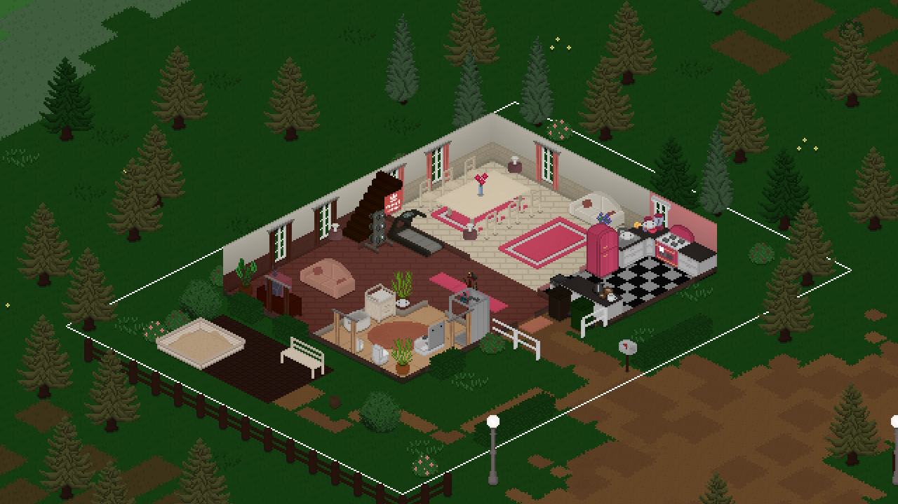
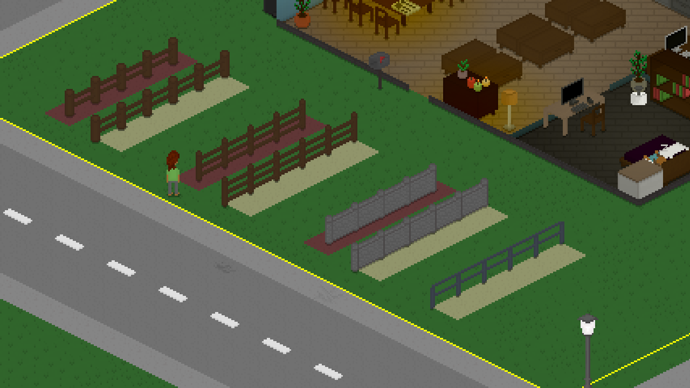
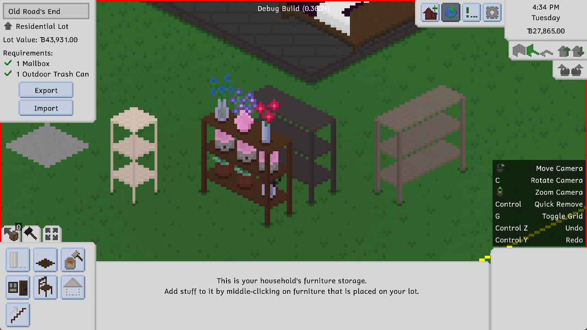
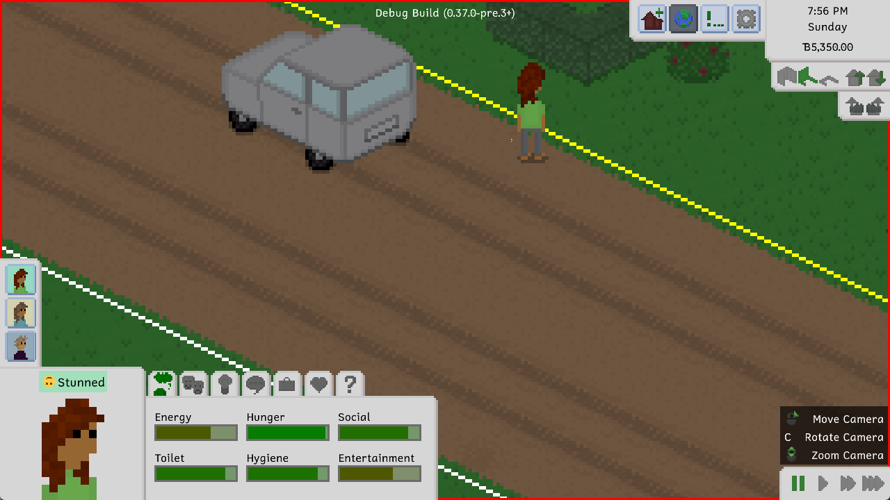

---
title: "0.37.0: Multiple Floors and Fences Galore"
tags: [Devlogs]
image: "23-10-25_11-50-12.png"
itch: "https://ellpeck.itch.io/tiny-life/devlog/625774/0370-multiple-floors-and-fences-galore"
steam: "https://store.steampowered.com/news/app/1651490/view/3752120943815757525"
---

Hey gang! It's been a minute since the last update with a devlog, but that's for a good reason: We've been hard at work getting this very update ready for all of you! It's a big one, so strap yourselves in.

# Going Up a Level
So, let me set the scene for you: Imagine you're playing this beautiful family, and they have a cute little bungalow, but now they have a kid! Oh no! There's not enough space for the kid to live! What*ever* shall they *do*?

Well. How 'bout they build a second floor??

Yea, you heard that right: You can now build a full second floor on your lots in Tiny Life. And better yet, you can build another floor on top of that! And then another floor on top of that! This means that you're able to build a total of five floors (two in the demo), and fill them with all your favorite furniture, and rooms, and decorations, and Tinies, of course.

Don't believe me? Well, take a look at this beautiful house built by Yellore, which you can also find [on the Steam workshop](https://steamcommunity.com/sharedfiles/filedetails/?id=3049696183).

You can find all the info you need on how to create and populate additional floors in the game, but it's pretty simple all in all: You can use the buttons in the top right of the screen (or keyboard or gamepad controls as described in the controls info box in the bottom-right of the screen) to switch which floor your camera should be focused on, and you can build and interact on the currently focused floor!

While this system is already fully functional and very usable, it may still have some bugs here and there, especially when it comes to rendering.  As always, please report any issues you find through [the feedback form](https://tinylifegame.com/bugreport), which is also linked in-game.

Joe feels like king of the world.

# Much Better Fences
As part of this update, and especially to accompany the new ability to create mezzanine levels and other types of holes in the ground, we've taken the opportunity to overhaul fences in the game.

If you don't remember, or you haven't played with them yet, fences used to be, well, a little bit of a mess. They were essentially furniture pieces that you could place down like any other objects, but they would automatically connect together. The trouble with them, though, was that they were always stuck to the center of the tiles they occupied (much like any other furniture, as well), and so using them as a sort of wall-like border between tiles was pretty much impossible. It also didn't help that placing them was a bit of a nuisance, since there was no way to drag them out or generally place multiple at once.

So, to fix this, we've taken the liberty to make them more like walls! You can now find the new Fencing tool as part of the build mode toolset, and all of the existing fences have been converted to the cool new ones. In addition to that, we've added a more modern metal-style fence that you can use in your builds as well!

In the above picture, you can see a comparison between the old-style fences (on the red tiles) and the new ones (on the yellowy green tiles). Cool, right?

## What About Old Fences?
A lot of the time when new features are added to Tiny Life, older ones are updated or changed automatically to accomodate them. For example, when fridges started being able to store items a few updates ago, their type changed from a regular furniture item to one that can store items - no manual replacement of fridges necessary.

Here's the thing, though: With these new fences, it's not really possible to do that. Think about it this way: If old fences, which occupy the center of tiles, are automatically converted to new ones... which side of the tile should they now occupy? Could there even be a consistent side, or would it have to vary based on the location and context of where and how the fence was being used? And what about places where old fences *can't* reasonably be converted, like a build in which fences are placed in the tile space between two walls?

Because of all of these issues, and essentially to leave it up to players how they want to structure their new fence-based empire, we've **deprecated** the old fences instead of fully removing them. This means that, when you load your saves, the old fences will still be present in the world, but you won't be able to **buy or place any new ones**. Over time, you're expected to replace all of your old fences with the new ones, and eventually, maybe in a few years or so, the old fences will be removed from the game for good.

To remind players of this transition, hovering over the old fences in build mode displays a tooltip that tells them exactly this information but, you know, a little less rambly.

# New Items
We also added a few new items, tiles and other fun objects since the last update. We've already gone over the new metal-style fence, which is lovely, of course, but we also added some new furniture!

As you can see, we introduced a new two-tile-wide version of the cute three-layer shelf that everyone loves. This shelf's surfaces work similarly to those of the existing dresser drawer: you can place three smaller items on it, or one large item in the center.

In addition to this, we've also added a cute new book stack item and a nice frilly rug, as well as a proper sand tile, so all of you mapmakers don't have to use a recolored version of the dirt path.

Also, and this is kind of a *secret* for an upcoming new map, we've added dirt roads as a non-buyable [map editing](https://docs.tinylifegame.com/articles/custom_maps.html) tile! These are meant to be placed with dirt paths on the sides to allow Tinies to walk along the side of the road, much like you would in real life when traversing a country road.

We're not going to tell you anything about the upcoming map set, but suffice it to say, it'll be very cute!

# Various Improvements
Here's another small feature for all of you mapmakers out there: by *extremely* popular request, you can now use certain tile types as paths that exit the borders of the map, allowing Tinies to head out of town or travel to another world without needing to get into their car. More specifically, these tiles are any concrete paths, as well as the dirt paths that people frequently used to use as sand. You may be able to guess why it was necessary to add a proper sand tile now.

As part of our journey to ever-improve existing features of the game, and as a reaction to a survey that we did *absolute eons ago*, we have improved upon the emotion stings in the game! Really, there were two major improvements here: Number one, most of the stings are a lot shorter now and fit the musical style of the game a lot better. Number two, the in-game music (should you have it enabled) now quiets down a bit while the stings are playing so that you're able to hear them in all their glory. Thanks so much, as always, to [Leiss Hoffman](https://leiss.bandcamp.com) and [Jamal Green](https://www.jamalgreenmusic.com/) for their amazing work and musical collaboration for the game.

# The Full Changelog
That's it for this update, everyone! As you can see, there are quite a lot of additions and changes in this one. If you want to see the full changelog, which is a lot this time around, you can find it in the bottom-right corner of the game's main menu as always, or right here!

Lastly, thanks so much again for the amazing feedback from everyone in the Tiny Life community, as well as the lovely builds, households and lots everyone has been sharing. Keep in mind that, if you want any of your custom content or other media related to Tiny Life showcased in an official capacity, you can check out the [Community Showcase](https://tinylifegame.com/community/) page on the website.

❤️ Ell

Additions
- Added the ability to build additional floors on lots, allowing up to 5 floors in the full game, and 2 in the demo
- Added a proper wall-like fencing system, including a new metal fence, and marked furniture-style fences as obsolete for future removal from the game
- Added a wide three-layer shelf, a small stack of books, and a rhombus rug
- Added a proper sand tile, which looks a lot better than the yellow dirt path color
- Added the ability to play online games with specific other tinies
- Added the ability to adopt babies as well
- Added a few more hair and skin colors
- Added Simplified Chinese translation, courtesy of [Zhao Huaye](https://space.bilibili.com/67102871). Thanks so much for your hard work!

Improvements
- Overhauled emotion stings and lower music volume while they're playing
- Add the exported version as a tag when uploading items to Steam workshop
- Automatically remove outdated custom content on game startup
- Allow chatting on the phone with multiple people at once
- Allow inviting over multiple people at once
- Made the AI choose from available people based on their relationship
- Paths at the borders of the map will now also count as exit points
- Improved auto-tile visuals, and made path colors auto-tile with each other
- Persist object repair progress between attempts
- Display thought bubbles when reading
- Allow people with lot employments to visit when being asked
- Display a person's age on their tooltip
- Snap wall-attached furniture to appropriate walls automatically in build mode
- Start jobs off with an active vacation day so that work doesn't start immediately
- Allow adoptive parents to take parental leave as well
- Allow undoing using ctrl+shift+z as well
- Display vehicle ownership as a tooltip
- Automatically create a save backup when game version or mods change
- Display destroy particles for walls and tiles on higher floors
- Display a wide new game button when there are no saves, rather than graying out the load button
- Inverted default steam cloud behavior, causing newly created saves to be cloud synced by default
- Use the natural placement sound for water objects
- Use newer masters of Leiss' soundtrack, which also includes some  previously missing bits
- Changed the furniture tool's name and icon to "Objects" to accommodate the fact that it also contains plants and other decorations
- Reduced the time it takes for new Steam subscriptions to be reflected in the game
- Display an info that the game needs to be restarted when enabling or disabling mods
- Remove roofs that intersect with newly created rooms

Fixes
- Fixed two people repairing an object breaking repair progress
- Fixed wall-related undos and redos not correctly restoring old rooms
- Catch any validation exceptions for map objects
- Fixed fairy lights crashing when not on a wall
- Fixed out-of-town actions counting as visible for babies
- Fixed the tile tool having visual issues in some camera rotations
- Fixed an exception when an enqueued social action has no valid partner
- Fixed collisions not updating correctly when moving some furniture
- Fixed undoing a room deletion not restoring the room correctly
- Fixed an exception when a person stops having a lot employment and then tries to go home
- Fixed a crash when a lot has no free tiles around the front door
- Fixed mods with broken localizations crashing the game on startup
- Fixed interior walls not displaying as down straight after placement
- Fixed people autonomously reading skill books that don't interest them
- Fixed regular visitors being deleted from maps removed from saves
- Fixed moving lots allowing roofs to be out of bounds
- Fixed a crash when loading an invalid save file in the demo

API
- Added MultiActionHandler initialize event
- Replaced action varieties with a new system, action arguments, which allows multiple arguments to be passed at once
- Allow adding more actions to the set of actions used by the Clean Everything action
- Dead people are now stored in their gravestone, rather than on the map the gravestone was first on
